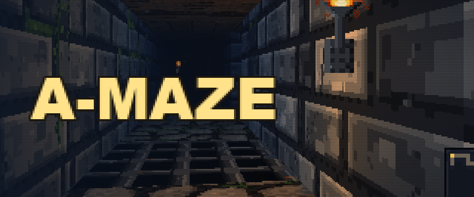
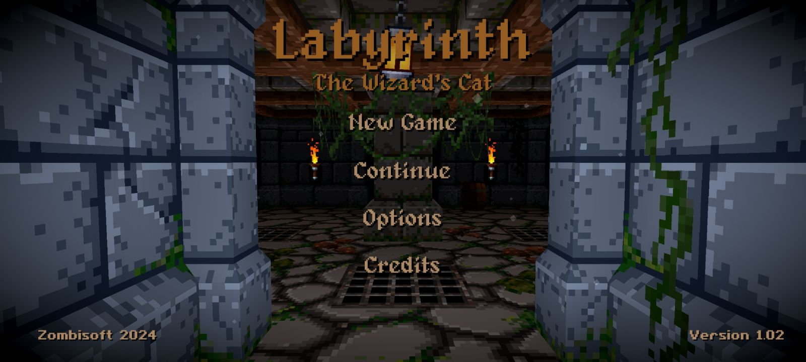
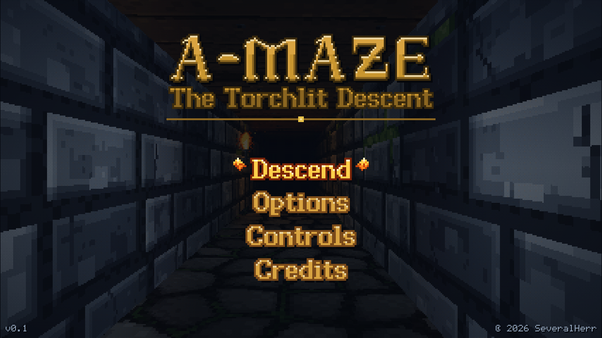
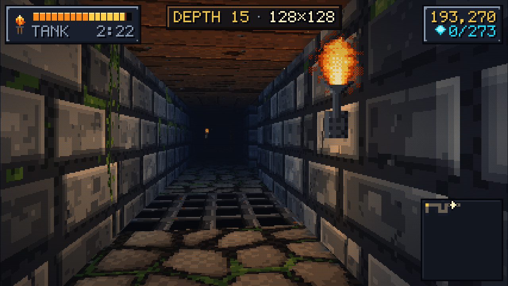
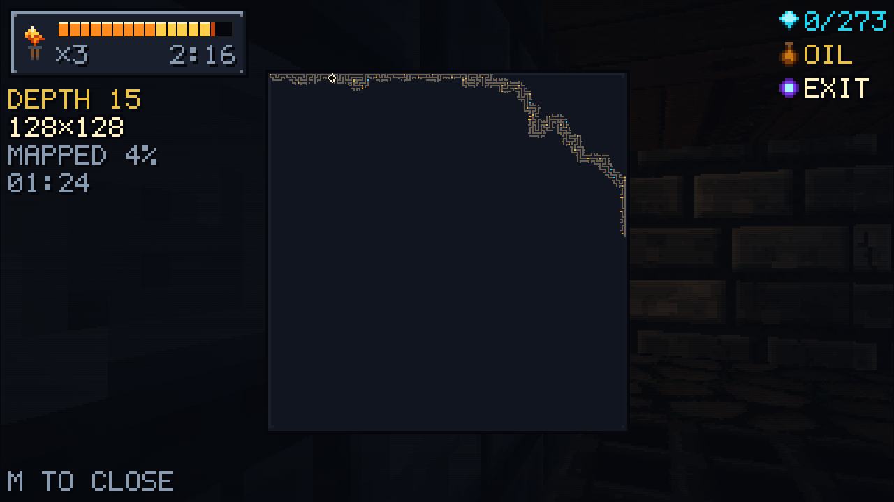
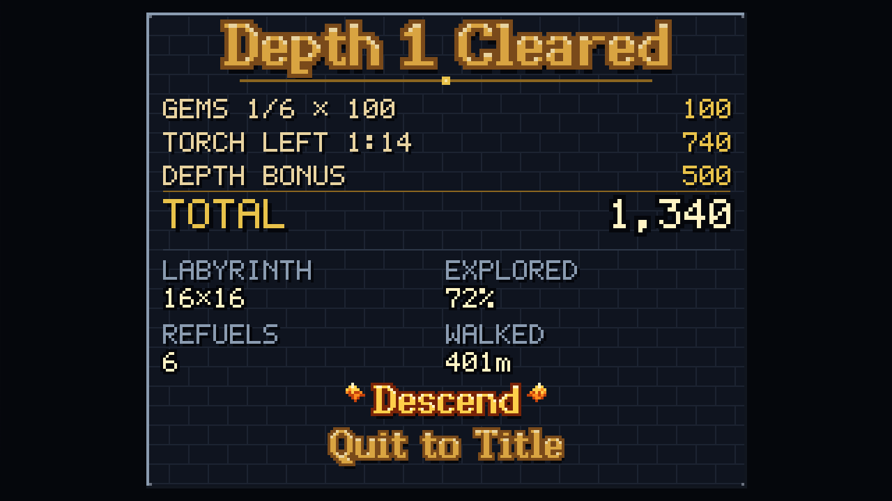

<p align="center">
  
</p>

<h1 align="center">A-MAZE</h1>

<p align="center">
  <em>The Torchlit Descent. Your torch is a tank, the labyrinth is massive, and the way out is always further down.</em>
</p>

<p align="center">
  <a href="https://severalherr.itch.io/a-maze"></a>
  
  
</p>

---

**[Play it in the browser &rarr;](https://severalherr.itch.io/a-maze)**

A retro, first-person, torch-lit dungeon crawler. Every descent is a freshly generated labyrinth,
from a 16×16-cell warm-up to a 128×128-cell maze with over 60,000 tiles of stone. The torch is the
clock: it burns all the time, oil flasks refill it, and when it goes out the run is over. Reach the
glowing portal to go down a level. Plain HTML, CSS and ES modules, with no build step, no framework
and no runtime dependencies. The maze generator, the validator and the whole simulation also run in
Node, which is how solvability and fuel balance are checked.

<details>
<summary><strong>The prompt this repo was built from</strong> (Opus 5 experiment)</summary>

  #### Directive

  Build an arcade-quality, retro 3D raycaster/tile-based maze wanderer in plain vanilla HTML5, CSS3, and native ES modules. Zero runtime dependencies, zero build steps, and zero framework bloat. Run it entirely client-side with high-performance WebGL/Canvas 2D rendering locked at a buttery 60fps.

  #### Architecture & Engineering Standards

  * **Modularity:** Establish strict subsystem separation (`/src/core`, `/src/maze`, `/src/renderer`, `/src/input`, `/src/state`, `/src/ui`). Write an initial `ARCHITECTURE.md` mapping out the dependency graph before dropping code.
  * **State Isolation:** Enforce a strict unidirectional data flow. Game logic must never block the render loop. If a procedural generation tick chokes, isolate the worker/async loop to prevent main-thread jank.
  * **Procedural Math:** Implement a guaranteed-solvable maze generation algorithm (e.g., randomized Prim’s, Recursive Backtracking with enforced path carving, or Eller's algorithm) paired with a headless verification runner that mathematically validates 100% solvability upon generation.

  #### Multi-Agent Orchestration Protocol

  Operate in a tightly managed swarming wave structure. Persist all state, metrics, and blocking errors to `docs/STATUS.json` after every step so iterations resume from the exact point of failure, never from scratch.

  1. **Wave 1 (Foundations):** Core state store, input handler, and the high-performance rendering canvas shell.
  2. **Wave 2 (Generation & Validation):** Procedural maze generator and automated pathfinding validator.
  3. **Wave 3 (HUD & Polish):** Timer, score tracking, responsive retro UI overlays, and audio/visual feedback cues.
  4. **The Integrator:** Handles cross-module wiring, seam repairs, and regression fixes. No module edits its neighbors directly; all inter-subsystem contracts go through the integrator.

  #### The Quality Gauntlet

  Every module must survive an automated critic pass scored out of 10 against top-tier web arcade games:

  * **Passing Grade:**  8.5 with zero console errors, steady 60fps frame budgets, and zero memory leaks.
  * **Feedback Loop:** If a module scores 8.5, the builder agent receives structured critique data and auto-revises up to 4 times.
  * **Final Stress Gate:** Run a dimensional stress test pushing grid scales to extreme limits to ensure zero infinite loops, stack overflows, or frame drops.

  #### Execution Rules

  * **No Programmer Art:** Clean, high-contrast, cohesive retro aesthetics, crisp scanline/pixel-grid scaling, and satisfying movement feedback.
  * **Autonomous Execution:** Do not ask clarifying questions or pause for design approvals. Make architectural decisions, document assumptions inline, and keep the dev server hot.
  * **Ultracode:** Output production-ready, heavily typed (via JSDoc), impeccably commented, bulletproof code.

  /loop until every critic passes with a score >= 8.5.

  #### Art Direction Example
  I love this pixel art style, please aim for this type of vibe.
  

  #### Itch.io setup
  Use skill /itch-store-page to setup https://severalherr.itch.io/a-maze when youre done.

  #### Github Workflow example
  Use the CICD from C:\Users\gotmi\Documents\GitHub\incremental-city-builder\.github

  Ultracode.

  ---

  Follow-up mid-run: *"I want the mazes to be massive. Are they?"* They were not (6×6 up to 40×40
  cells), which led to the size curve, the refillable-torch economy and the full map below.

</details>

## Screenshots

| | |
|---|---|
|  |  |
| **The title.** The attract-mode camera wanders a real maze behind the menu. | **Depth 15.** Stone blocks, moss, wall sconces and a wooden ceiling, all painted in code at load. |
|  |  |
| **The full map at 128×128.** Ninety seconds in, the explored route is a thin line along one edge. | **Depth cleared.** Gems, leftover torch and depth bonus, plus maze size, explored %, refuels and distance walked. |

## Play it

| Input | Action |
|---|---|
| `W` `S` / `↑` `↓` | Move forward / back |
| `A` `D` | Strafe |
| `Q` `E` / `←` `→` / mouse | Turn (click the view to lock the mouse) |
| `Shift` | Sprint (the torch burns 1.5× faster) |
| `M` / `Tab` | Cycle the map: off → corner → full |
| `Esc` / `P` | Pause · `N` mute · `Enter` / `Space` confirm |

Gamepads (standard mapping) and touch both work: a virtual stick on the left of the screen, drag to
look on the right, and on-screen pause and map buttons.

**How a level works.** Levels start at 16×16 cells and grow by 8 cells a side per level, up to
128×128 at depth 15. After that they get harder instead of bigger. The torch holds 110–150 seconds
of fuel whatever the maze size, so the tension comes back every minute or so rather than
being one long countdown. Oil flasks refill about a third of the tank, and gems score
`100 × depth`. Clearing a level scores `500 × depth + 10 × depth` per second of torch left.

## Run it

```sh
npm install                # puppeteer-core only (headless verification)
npm run serve              # static server on http://localhost:5173 — keep it running
```

Open http://localhost:5173. Best score and settings are saved to `localStorage`.

| URL | What it does |
|---|---|
| `/?debug=1` | FPS counter and logging |
| `/?seed=1337` | Pins the run seed, so the same mazes come up every time |
| `/?headless=1` | Exposes `window.__game` (state, dispatch, stepOnce, input injection) for tools |
| `/src/renderer/preview.html` · `/src/ui/preview.html` | Standalone harnesses for the renderer and every UI screen |

## Check it

| Command | What it does |
|---|---|
| `npm test` | Runs every `src/*/*.test.mjs` in its own Node process: 647 tests in 37 files. |
| `node tools/validate-mazes.mjs` | The solvability runner. It generates 117,306 mazes from 1×1 to 512×512 cells, with loop density (braid) from 0 to 1, and checks each one: solvable, fully connected, sealed border, and no loops when braid is 0. It also builds the 30-level campaign × 25 seeds and checks the refuel chain on each. Any failure exits non-zero. Pass `--quick` for a short run. |
| `node tools/stress.mjs` | Extreme grid sizes (2000×2000 cells, a 1×4096 corridor, oversize input must throw a clean `RangeError`), the gameplay maximum over 100 seeds, and leak loops. |
| `node tools/verify.mjs --tag x` | Headless Chrome (needs `npm run serve`). An autopilot plays level 1 through the real maze, goes down to the size cap and plays it for 60 s. It measures fps, render and step time, heap growth and CPU-throttled performance, and fails on any console or page error. Writes `logs/x.json` and `logs/shot-x-*.png`. |

## Layout

```
index.html, styles.css  entry page; layers #view → #post → #overlay → #touch
src/
  main.js               composition root: boot, wiring, level builds, loop, ?headless / ?debug
  core/                 fixed-timestep loop, seeded rng, events, math, pools, logging, shared JSDoc types
  maze/                 generator (iterative backtracker + braid), validator (BFS), populate (items,
                        torches, refuel chain), level builder, Web Worker + client with sync fallback
  state/                store, reducer + phase machine, sim (movement, collision, pickups, fog of war),
                        balance (every tuning number), save
  input/                keyboard, pointer lock, gamepad, touch stick + overlay, bindings
  renderer/             palette, procedural textures, Canvas 2D raycaster, sprite index, particles, post fx
  ui/                   bitmap fonts, HUD, map, menus, formatting, WebAudio synth
tools/
  serve.mjs             dev server        test.mjs            `npm test` runner
  validate-mazes.mjs    solvability runner   stress.mjs       extreme-scale gate
  verify.mjs            headless-Chrome autopilot gate
docs/
  STATUS.json           waves, critic scores, open issues, blockers
  PROMPT.md             the original brief     art-reference.png   the art direction
.claude/workflows/
  gauntlet.js           the critic workflow (critique → revise → integrate → stress gate)
logs/                   tool output (git-ignored)
```

`ARCHITECTURE.md` is the binding contract: shared types, every module's signatures, the
allowed-import table and the data flow.

## Module isolation

One folder per subsystem, one owner each. A builder edits only its own folder. `src/main.js`,
`tools/` and every cross-module seam go through the integrator. `core`, `maze` and `state` never
touch the DOM and must import cleanly in Node. Data flows one way:
input produces a frame, the reducer updates store-owned state, and the renderer, HUD and audio
only read it. UI actions go back through `dispatch`. Maze generation runs in a module Web Worker,
so building a 128×128 level never stalls a frame: the longest gap between frames was 6.6 ms while
one generated.

At the maximum size a level has ~820 items, ~1,300 torches and a 66,049-tile fog-of-war grid, so
**nothing runs over every item or every tile each frame or each step.** Pickups use a bucket grid,
sprites and torch lights use a spatial index, and the map redraws only newly explored tiles.

## Why every maze is solvable

The generator is an iterative randomized depth-first backtracker with an explicit `Int32Array`
stack, so no recursion and no stack overflow at any size. Every cell is visited exactly once, and
each visit carves exactly one passage to an already-visited cell. That gives n − 1 passages
connecting all n cells with no cycles (a spanning tree), so every cell can reach every other.
Braiding only removes walls, so it adds loops without breaking any path. The exit is the cell
farthest from the start by BFS, which guarantees a long route. The validator is a separate BFS that
checks all of this again for every generated maze, and a level that fails validation is never
handed to the game.

The torch economy has its own guarantee. Along the solution path, the gap between refuels that can
be reached never exceeds what a full tank covers when you wander twice as far as the direct route.
`validate-mazes` asserts this on all 750 campaign levels. The worst point across them all still
leaves 70% of a tank. A simulation test runs 250 levels (depths 1–25 × 10 seeds) at 2× wander, and
all 250 reach the exit.

## Measured

From `logs/final.json` (`node tools/verify.mjs --tag final`, 2026-09-16):

- **PASS**, 0 console errors, 0 warnings, 0 page errors.
- Level 1 (16×16) cleared by the autopilot in 139 s with 74 of 110 s of torch left.
- At the size cap (128×128 cells, 755 items, 1,290 torches), a 60 s run averaged 474 fps
  uncapped (120 capped to the display), 0.053 ms per step, 1.75 ms per render (99th percentile
  2.5 ms), and the heap grew by 0.21 MB.
- CPU slowed 4×: 102 fps, render 7.5 ms average.
- Stress: a 2000×2000-cell maze (16 M tiles) generates in ~0.7 s and validates in ~0.8 s.

## The critic gate

Every module is scored 0–10 by an independent critic against top-tier web arcade and retro dungeon
games. A module passes at ≥ 8.5 with zero errors and no high-severity issues. Failing builders get
structured critique and revise, then the integrator re-verifies and commits. The record is
`docs/STATUS.json`.

Last scores (round 2): **maze 8.7 and core 8.5 pass**; audio 8.1, input 8.0, state 7.6,
renderer 7.5, ui 7.2 below the bar. The round 2 revisions for those five are committed but have not
been re-scored. The loop was stopped after two rounds to save usage. Re-run it with the
`.claude/workflows/gauntlet.js` workflow, optionally with `args: {only: ["renderer", "ui"]}`.

## Deploy

Every push to `main` runs `.github/workflows/deploy-to-itchio.yml`. It checks the credential first,
runs `npm test`, `validate-mazes` and `stress` so a broken generator can never ship, assembles
`index.html`, `styles.css` and `src/` into `dist/`, and pushes that directory to
[`severalherr/a-maze:html5`](https://severalherr.itch.io/a-maze) with butler, stamped with the short
commit SHA. It needs the `BUTLER_API_KEY` repository secret:

```sh
gh secret set BUTLER_API_KEY --repo SeveralHerr/a-maze --body "$KEY"   # key from itch.io/user/settings/api-keys
```
